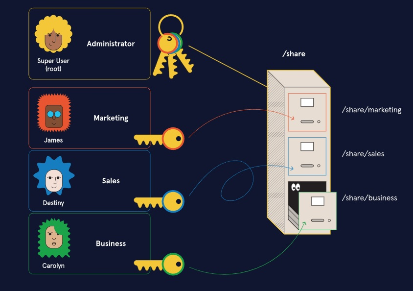

Linux Users & Permissions
Learn about how defining users and permissions works in Linux!

Linux supports multiple users on the same system. There are different tiers of users, including an admin type, which can make changes on other users and file permissions.

In this section, learn about different types of users and groups, and how file permissions work in a Linux environment.

We will have a lesson, quiz, and instructions for an off-platform project. Let’s get started!

